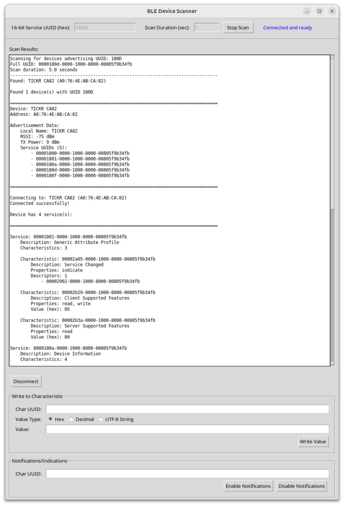

# Intro

**bleExp** is a simple Bluetooth Low Energy explorer app. It lets the user discover BLE devices that advertise the specified service UUID, connect to the device, and list all its services, characteristics, and descriptors.  

The app automatically reads the value of all the readable characteristics, and lets the user write an arbitrary value to any of the writeable characteristics. The value to be written can be specified in hex, decimal, or UTF-8 string. 

The app also lets the user enable or disable notifications/indications on any charactersitic that supports them, and the notifications/indications received from the BLE device are shown on the app's output log.

The image below shows the **bleExp** app connected to a Wahoo TICKR Heart Rate sensor that supports the BLE SIG's [Heart Rate Service](https://www.bluetooth.com/specifications/specs/html/?src=HRS_v1.0/out/en/index-en.html) and [Device Information Service](https://www.bluetooth.org/docman/handlers/downloaddoc.ashx?doc_id=244369&_gl=1*vekdxv*_gcl_au*MTQ5OTA1NTk2OS4xNzU2Mzk2MTMy), along with a few custom (private) services:



# Running the app

The app is written entirely in Python, using [tkinter](https://docs.python.org/3/library/tkinter.html) for the GUI and [bleak](https://github.com/hbldh/bleak) for BLE communication with the peripheral device.

To run the app inside a virtual environment, simply follow these steps:

``` bash
python3 -m venv venv
source venv/bin/activate
pip install bleak
python bleExp.py
```
# Credits

The code for this app was developed via an interactive session with the [Claude AI](https://www.claude.ai) assistant. It took only 10 back-and-forth's with the chatbot to come up with this working version.
