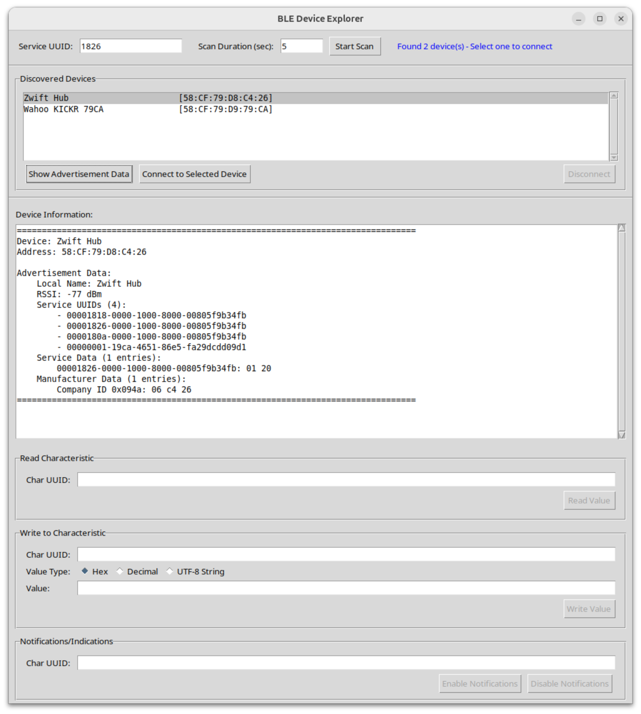

# Intro

**bleExp** is a simple Bluetooth Low Energy explorer app that supports the following features:

1. It can discover BLE devices that advertise a specified service UUID.
2. It can display the Advertisement Data sent by the selected device in its Advertisement Indication and Scan Response BLE messages.
3. It can connect to the selected device and discover all its services and their characteristics. Characteristics that support the READ property have their value automatically read.
4. It can write an arbitrary value to any characteristic which supports the WRITE property.
5. It can enable/disable notifications/indications on any characteristic that supports the NOTIFY/INDICATE property.
6. It can save all session data into a log file.

The image below shows the **bleExp** app discovering indoor bike trainers that support the [Fitness Machine Service](https://www.bluetooth.com/specifications/specs/html/?src=ftms-v1-0-1_1756429637/FTMS_v1.0.1/out/en/index-en.html), to which the BLE SIG assigned the UUID 0x1826. In this example the app discovered two devices: a Wahoo KICKR and a Zwift Hub.  Selecting any of the discovered devices and pressing the "Show Advertisement Data" button displays all the data sent by the device in its Advertisement Indication and Scan Response messages:



Pressing the "Connect to Selected Device" button makes the app establish a connection to the target device, and discover all its services and characteristics. Characteristics that support the READ attribute are automatically read, and the value is shown on the output log:


Next we enable indications on the Fitness Machine Control Point characteristic (0x2AD9), and send the Request Control command to the trainer by writing the corresponding opcode (0x00) into the FMCP.  After completing the command, the indoor trainer sends out an indication carrying the status code:


Next we enable notifications on the Indoor Bike Data characteristic (0x2AD2) and we can see the app logging the periodic notifications sent out by the trainer once a second:


Finally, the image below shows **bleExp** running under macOS.  Notice that in this case the device scan output shows a 128-bit UUID intead of the BLE MAC address:


# Running the app

The app is written entirely in Python, using [tkinter](https://docs.python.org/3/library/tkinter.html) for the GUI and [bleak](https://github.com/hbldh/bleak) for BLE communication with the peripheral device.

To run the app inside a virtual environment on Linux or macOS, simply follow these steps:

``` bash
python3 -m venv venv
source venv/bin/activate
pip install bleak
python3 bleExp.py [--svc-uuid <uuid>] [--scan-duration <seconds>] [--log-file <path>] [--text-font-size <points>]
```
--svc-uuid specifies the Service UUID to scan for in the BLE advertisements.

--scan-duration specifies the duration (in seconds) of the device scan process.

--log-file specifies the pathname of the file where the app saves all the log output.

--text-font-size specifies the size (in points) of the font used to display the output text.

On systems that use the GNOME desktop, the supplied bleExp.desktop file can be used to launch the app. In the following instructions _path_ is the full path to the folder where bleExp was installed:

``` bash
cp bleExp.desktop $HOME/.local/share/applications/
chmod +x $HOME/.local/share/applications/bleExp.desktop
sed -i s'/path-to-bleExp-folder/<path>/' $HOME/.local/share/applications/bleExp.desktop
```

In some cases you may need to log out and log back in for the **bleExp** icon to show up in the app launcher panel.

# Credits

The code for this app was developed via an interactive session with the [Claude AI](https://www.claude.ai) assistant. It took about 10 back-and-forth's with the chatbot to come up with the initial working version.
