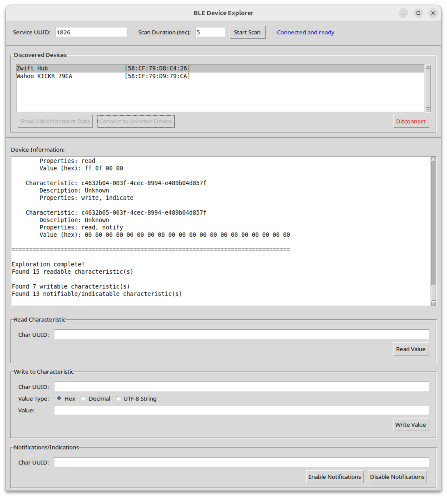
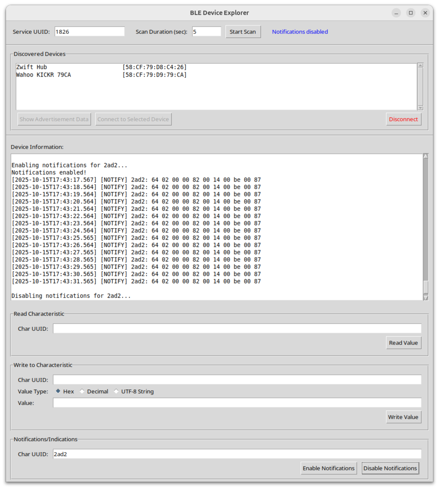

# Intro

**bleExp** is a simple Bluetooth Low Energy explorer app that supports the following features:

1. It can discover BLE devices that advertise a specified service UUID.
2. It can display the Advertisement Data sent by the selected device in its Advertisement Indication and Scan Response BLE messages.
3. It can connect to the selected device and discover all its services and their characteristics. Characteristics that support the READ property have their value automatically read.
4. It can write an arbitrary value to any characteristic which supports the WRITE property.
5. It can enable/disable notifications/indications on any characteristic that supports the NOTIFY/INDICATE property.
6. It can save all session data into a log file.

The image below shows the **bleExp** app discovering indoor bike trainers that support the [Fitness Machine Service](https://www.bluetooth.com/specifications/specs/html/?src=ftms-v1-0-1_1756429637/FTMS_v1.0.1/out/en/index-en.html), to which the BLE SIG assigned the UUID 0x1826. In this example the app discovered two devices: a Wahoo KICKR and a Zwift Hub.  Selecting any of the discovered devices and pressing the "Show Advertisement Data" button displays all the data sent by the device in its Advertisement Indication and Scan Response messages:


Pressing the "Connect to Selected Device" button makes the app establish a connection to the target device, and discover all its services and characteristics. Characteristics that support the READ attribute are automatically read, and the value is shown on the output log:



Next we enable indications on the Fitness Machine Control Point characteristic (0x2AD9), and send the Request Control command to the trainer by writing the corresponding opcode (0x00) into the FMCP.  After completing the command, the indoor trainer sends out an indication carrying the status code:


Finally, the image below shows the FTMS's Indoor Bike Data notifications (0x2AD2) sent by the indoor bike trainer once a second:



# Running the app

The app is written entirely in Python, using [tkinter](https://docs.python.org/3/library/tkinter.html) for the GUI and [bleak](https://github.com/hbldh/bleak) for BLE communication with the peripheral device.

To run the app inside a virtual environment, simply follow these steps:

``` bash
python3 -m venv venv
source venv/bin/activate
pip install bleak
python3 bleExp.py [--svc-uuid <uuid>] [--log-file <path>]
```
The optional command line argument --svc-uuid specifies the Service UUID to scan for in the BLE advertisements, while the argument --log-file specifies the pathname of the log file.

The supplied bleExp.desktop file can be used to launch the app using the GNOME desktop. Simply copy the file to your $HOME/.local/share/applications folder, and replace all instances of "/path/to/bleExp/install/folder/" with the appropiate full path to the folder where the app was installed.

# Credits

The code for this app was developed via an interactive session with the [Claude AI](https://www.claude.ai) assistant. It took only 10 back-and-forth's with the chatbot to come up with this working version.
